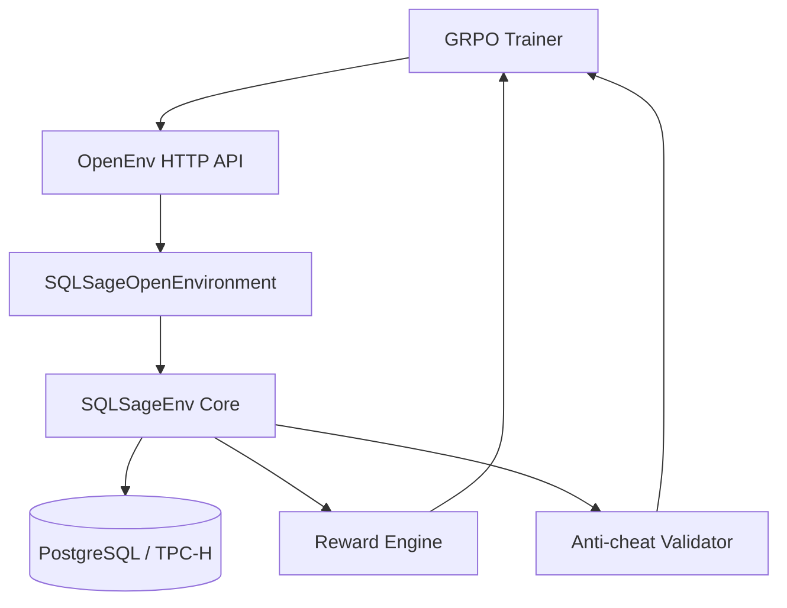

# SQLSage: Teaching AI to Optimize SQL in the Real World

## One-line pitch

SQLSage is an OpenEnv-compatible reinforcement learning environment where an agent learns to rewrite SQL queries for lower latency on PostgreSQL, while preserving exact result semantics with anti-cheat guarantees.

## The big problem

Modern data teams run thousands of analytical SQL queries every day. Even small inefficiencies compound into:

- Higher cloud bills
- Slower dashboards
- Delayed business decisions
- Friction between data engineers and analysts

Classical tuning helps, but it is manual, expert-heavy, and hard to scale across changing workloads.

## Why this project matters

SQLSage turns SQL optimization into a trainable decision process:

- The model sees real query plans and schema context.
- It proposes a rewrite action.
- The environment executes safely on PostgreSQL.
- Reward is computed from measurable performance and correctness.

This transforms tuning from one-off human work into a repeatable learning system.

## Core idea

Each episode starts from a baseline query and iteratively improves it. The policy receives structured context (query, plan, diagnostics) and must produce rewrites that are both valid and faster.

### What the model observes

- Original SQL query
- Parsed EXPLAIN plan
- Execution latency
- Schema summary
- Rewrite history and step count

### What the model can do

- `rewrite_join`
- `add_cte`
- `push_filter`
- `reorder_joins`
- `suggest_index`
- `limit_early`
- `revert`

### When an episode ends

- Target latency reached, or
- Maximum step budget consumed

## Architecture (practical and deployable)

The system is designed to run both locally and in Hugging Face Spaces.

## Reward design and anti-cheat

A useful optimizer is not only fast; it must be correct.

SQLSage uses multi-signal feedback:

- Positive reward for latency reduction
- Plan-level improvements for structural query quality
- Penalties for syntax errors, invalid actions, and timeouts
- Strong penalties if rewritten query changes output semantics

Anti-cheat is enforced through result-hash and row-consistency checks, preventing reward hacking.

## Training pipeline

The training stack is built around Unsloth + TRL GRPO and OpenEnv HTTP interactions.

Key scripts:

- `train.py`: Space-ready GRPO training entrypoint
- `scripts/rollout_wandb.py`: rollout and metrics logging
- `scripts/compare_rollouts.py`: baseline vs trained report generation
- `plots/generate_plots.py`: judging-ready curve generation

Colab integration:

- `notebooks/sqlsage_grpo_colab.ipynb`

## Data and benchmark context

SQLSage is oriented around TPC-H style workloads (SF1-compatible setup in this project), with representative tables like:

- `lineitem` (~6M rows)
- `orders` (~1.5M rows)
- `customer` (~150K rows)
- `part` (~200K rows)

This matters because optimization choices under realistic cardinalities are different from toy datasets.

## Results snapshot (current repo evidence)

From `results/baseline_vs_trained.md`:

- Mean episode return improved: `2.32 -> 5.10`
- Mean final query latency improved: `0.6 ms -> 0.5 ms`
- Syntax penalties stayed at `0.00`
- Result-changed penalties stayed at `0.00`

This indicates better policy behavior with no correctness regressions in sampled rollouts.

## What makes SQLSage different

- Real DB execution, not synthetic-only rewards
- Explicit anti-cheat enforcement
- OpenEnv compatibility for evaluator tooling
- End-to-end path from environment to training to submission artifacts

## Product and presentation direction

To make this project stand out in demos and judging:

- Add a short animated demo GIF showing reset -> step -> improved metrics
- Export W&B curves as presentation-ready visuals
- Keep a clear before/after narrative in the README and video
- Highlight correctness-first optimization

## Challenges and lessons

- Query optimization is highly context-dependent; generic text prompting is not enough.
- Strong guardrails are required to prevent reward exploitation.
- Reproducible logs and reports are as important as model checkpoints.

## Roadmap

- Increase query diversity and curriculum depth
- Add richer plan graph features for policy conditioning
- Expand evaluation to heavier workloads and longer episodes
- Publish a production-grade benchmark report with confidence intervals

## Closing

SQLSage demonstrates a practical direction for autonomous database optimization: learn from real systems, optimize safely, and prove gains with transparent evidence.

If your stack depends on SQL performance, this is the kind of RL environment that can evolve from research prototype to engineering utility.
