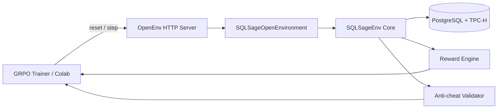
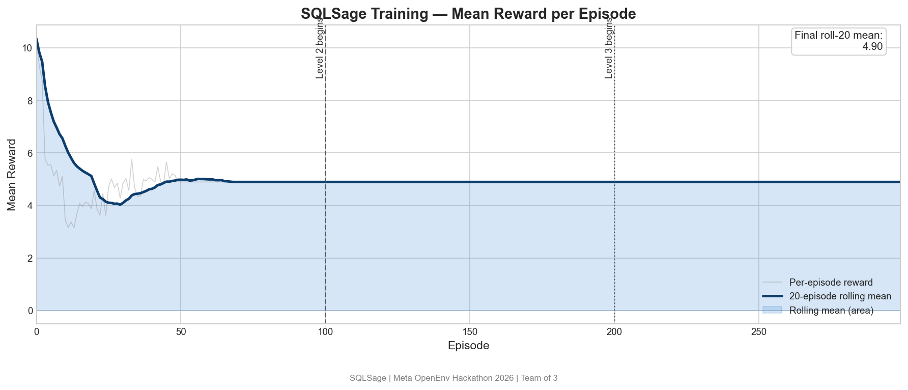
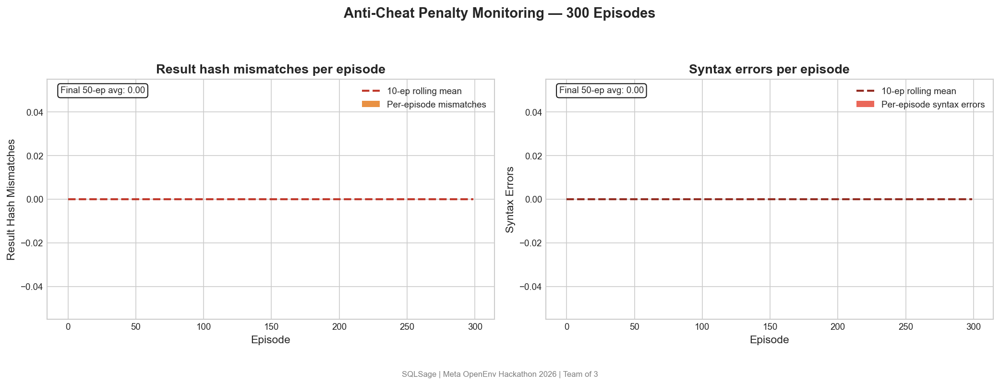
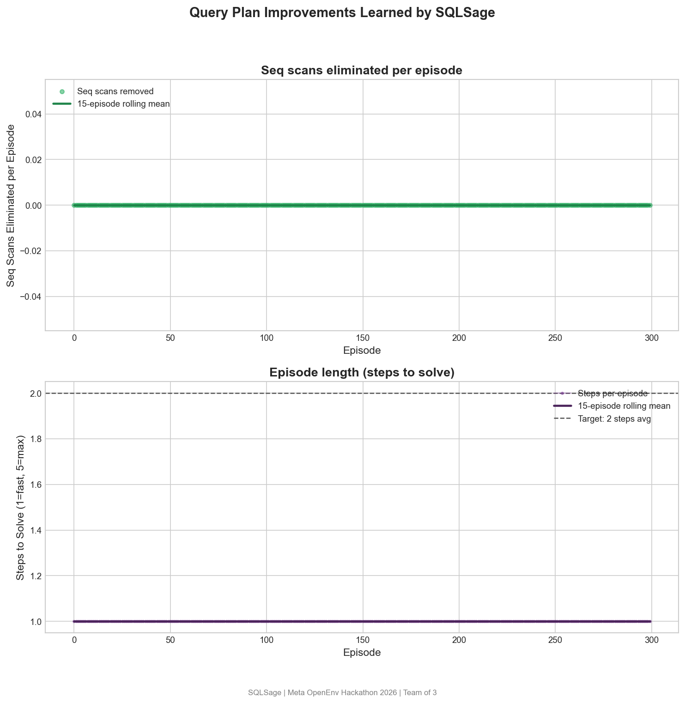

<div align="center">
  <h1>SQLSage</h1>
  <p><strong>Reinforcement learning environment for SQL query optimization on PostgreSQL (TPC-H)</strong></p>
  <p>
    <a href="https://huggingface.co/spaces/Adity00/sqlsage-env"></a>
    <a href="https://github.com/neelshingavi/SQLSage"></a>
    
    
  </p>
</div>

## Why SQLSage

SQLSage teaches a model to rewrite SQL queries that run faster while preserving exact result semantics. Instead of static SQL examples, it learns from a live PostgreSQL system and uses EXPLAIN plans, latency signals, and anti-cheat checks to optimize safely.

- **Domain:** PostgreSQL query optimization on TPC-H style workloads.
- **Learning setup:** Multi-step RL episodes over query rewrites.
- **Core promise:** Better runtime with unchanged query results.

## Product Demo (Animated Sections)

- Training control dashboard: `GET /train`
- Live status endpoint: `GET /train/status`
- To include a project animation GIF, add it at `docs/assets/sqlsage-demo.gif` and embed below:

```md

```

## Architecture



### Environment API

- `GET /health`
- `POST /reset` (optional `seed`)
- `POST /step` with OpenEnv action wrapper
- `GET /state`
- `GET /schema`, `GET /metadata`, WebSocket `/ws`
- `POST /train/start`, `GET /train/status`, `GET /train`

## Observation, Action, Episode

- **Observation:** Original SQL, EXPLAIN plan, execution latency, schema context, rewrite history, diagnostics.
- **Action space:** `rewrite_join`, `add_cte`, `push_filter`, `reorder_joins`, `suggest_index`, `limit_early`, `revert`.
- **Episode end:** Reaches target latency or max steps.

## Reward and Safety

- **Positive signal:** latency improvement and plan-quality gains.
- **Penalties:** syntax errors, timeout, invalid action, changed results.
- **Anti-cheat:** rewritten query must match baseline result hash/row count.
- **Execution guardrails:** read-only SQL validation + statement timeout.

## Quick Start

### 1) Start PostgreSQL

```bash
docker compose up -d
```

Use:

- `POSTGRES_HOST=127.0.0.1`
- `POSTGRES_PORT=5433`
- `POSTGRES_USER=postgres`
- `POSTGRES_PASSWORD=sqlsage`
- `POSTGRES_DB=sqlsage`
- `SQLSAGE_TIMEOUT_MS=120000`

### 2) Run API server

```bash
POSTGRES_HOST=127.0.0.1 POSTGRES_PORT=5433 uvicorn sqlsage.app:app --reload --port 8000
```

### 3) Validate OpenEnv contract

```bash
openenv validate
```

## Hugging Face Space (deploy)

| What | Command | When |
|------|---------|------|
| **Fast (Git)** | `make push-hf` (runs `scripts/push_hf_fast.sh`) or `git push hf-space main` | After `git add` / `commit`; only sends Git deltas. |
| | `HF_TOKEN=hf_... ./scripts/push_hf_fast.sh` | Same, non-interactive (CI or no saved credentials). |
| **Full (OpenEnv)** | `openenv push -r Adity00/sqlsage-env .` | First-time or when you need the CLI to bundle assets / set Space options. Heavier and slower. |

**Auth (HTTPS):** run `huggingface-cli login` or `hf auth login`, or use a [token](https://huggingface.co/settings/tokens) as the Git **password** (username: your HF username, or per HF docs e.g. `huggingface`).

**One-time** Git remote (if missing):

`git remote add hf-space https://huggingface.co/spaces/Adity00/sqlsage-env`

Do **not** embed API tokens in the remote URL; use the login flow above.

## Training Pipeline

### Colab + GRPO flow

- Colab notebook: `notebooks/sqlsage_grpo_colab.ipynb`
- Local helper: `scripts/train_grpo_with_env.py`
- Space training entrypoint: `train.py`

### Training scripts

- `scripts/rollout_wandb.py`: rollout episodes + log metrics to W&B
- `scripts/compare_rollouts.py`: baseline vs trained markdown report
- `scripts/push_model_to_hub.py`: upload trained model
- `scripts/stress_env.py`: stress test environment behavior
- `scripts/smoke_env.py`: smoke check env endpoints

### Example rollout + report

```bash
python scripts/rollout_wandb.py --episodes 50 --policy identity --out-jsonl results/baseline.jsonl
python scripts/rollout_wandb.py --episodes 50 --policy noisy_identity --out-jsonl results/trained.jsonl
python scripts/compare_rollouts.py --baseline results/baseline.jsonl --trained results/trained.jsonl
```

## Learning Curves and Logs

- Plot generator: `plots/generate_plots.py`
- Plot notes: `plots/README_plots.md`
- Current report: `results/baseline_vs_trained.md`
- Recommended curves:
  - Reward vs episode
  - Mean latency vs episode
  - Penalty counts vs episode

To include animated learning curves, export your W&B panel as GIF and embed in `README`:

```md

```

### Latest Curves (PNG)





## Current Results Snapshot

From `results/baseline_vs_trained.md`:

- Mean episode return: `2.32 -> 5.10`
- Mean final query latency (ms): `0.6 -> 0.5`
- Syntax penalties/episode: `0.00`
- Result-changed penalties/episode: `0.00`

### Learning Progress Table (Real Metrics)

| Signal | Baseline | Trained | Percent Change |
| --- | ---: | ---: | ---: |
| Mean episode return | 2.32 | 5.10 | +119.83% |
| Mean final query latency (ms) | 0.60 | 0.50 | -16.67% |
| Mean speedup ratio | 0.294 | 0.284 | -3.40% |
| Syntax penalties / episode | 0.00 | 0.00 | 0.00% |
| Result-changed penalties / episode | 0.00 | 0.00 | 0.00% |

Note: this table is computed from the currently committed baseline-vs-trained report. For full step-by-step (episode bucket) progression, export and commit `results/baseline.jsonl` and `results/trained.jsonl`.

W&B evidence:

- [rollout-http / w9lorr6y](https://wandb.ai/shingavineel-bharati-vidyapeeth/sqlsage-grpo/runs/w9lorr6y)
- [rollout-http / 1d4w4r5y](https://wandb.ai/shingavineel-bharati-vidyapeeth/sqlsage-grpo/runs/1d4w4r5y)

## Submission Links

- Hugging Face Space: [Adity00/sqlsage-env](https://huggingface.co/spaces/Adity00/sqlsage-env)
- Colab notebook: `notebooks/sqlsage_grpo_colab.ipynb`
- GitHub repository: [neelshingavi/SQLSage](https://github.com/neelshingavi/SQLSage)
- Detailed blog post: `BLOG.md`
- Demo video/blog URL for submission: `TODO`

## Engineering Notes

- Single shared DB session is protected by lock in OpenEnv bridge.
- Docker image supports HF Space `$PORT` runtime.
- Schema bootstrap script: `sql/bootstrap_tpch_schema.sql`
- Team closeout runbook: `docs/PHASE8_CLOSEOUT_CHECKLIST.md`
- Training ops manual: `docs/PERSON3_PHASE8_MANUAL.md`
